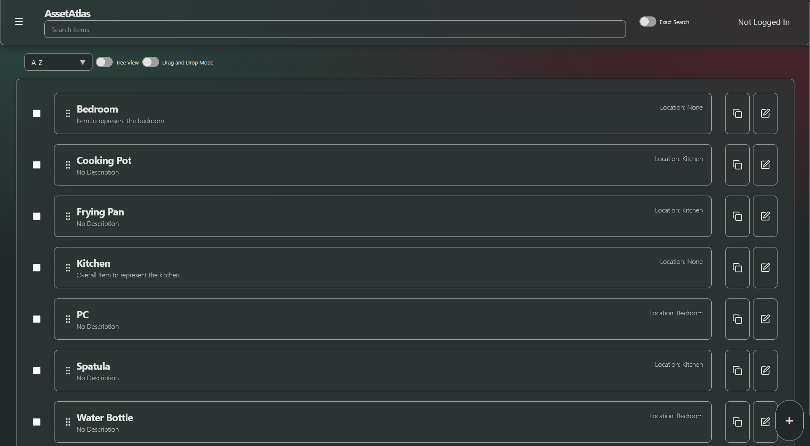
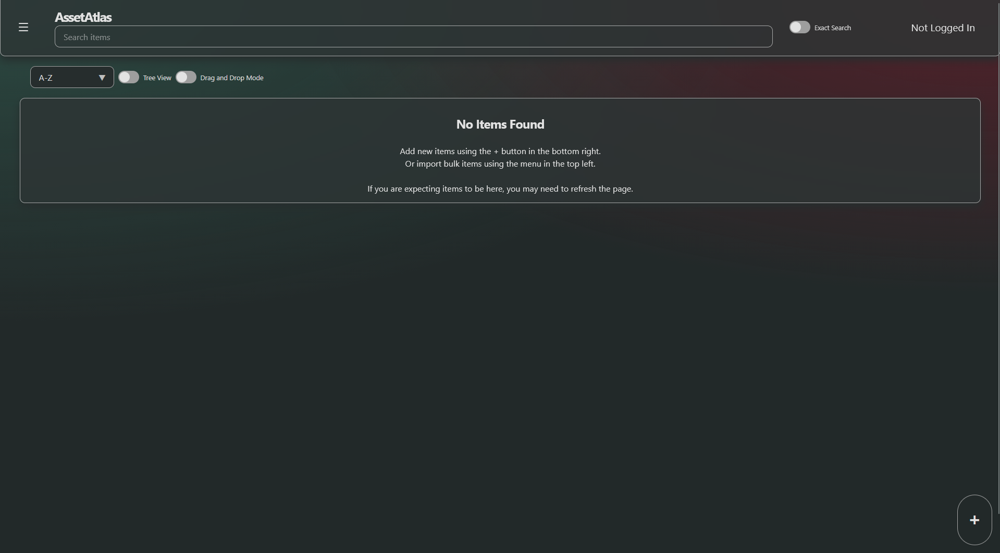
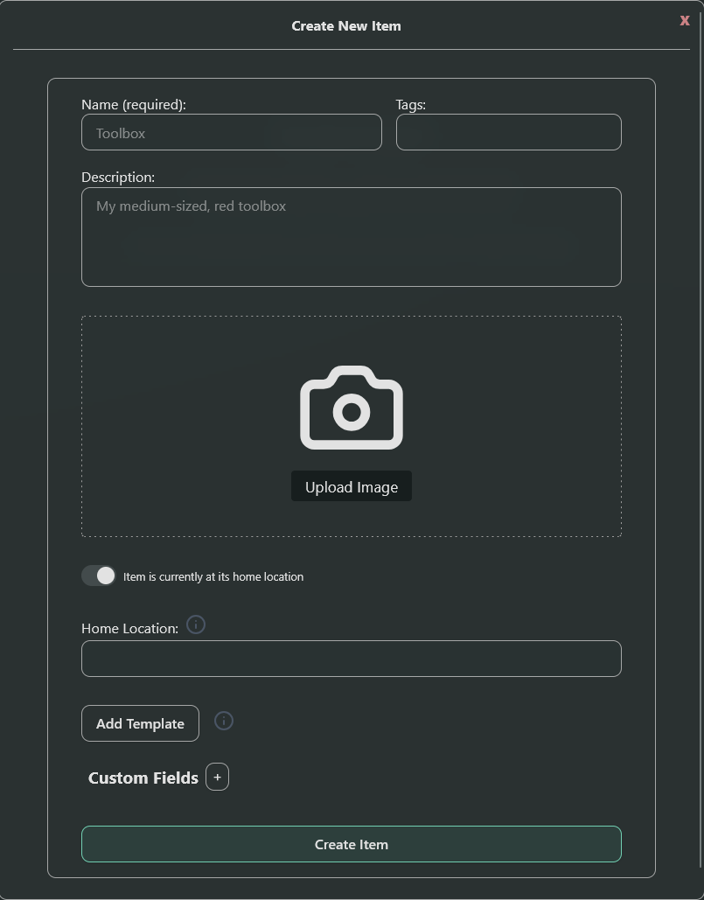
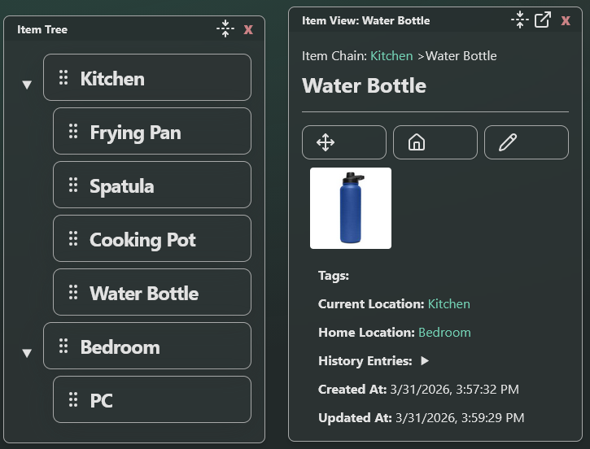
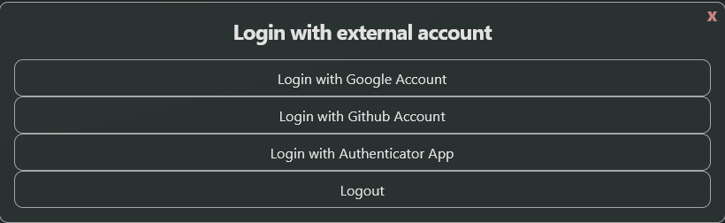

# AssetAtlas

AssetAtlas is a self hosted inventory and asset management app that helps you organize, track, and manage everything you own. AssetAtlas gives you a clear, centralized view so you always know what you have and where it is, great for keeping track of items around the house or managing tools in a maker space. If this appeals to you, you can download the project [here](https://github.com/AssetAtlasTracker/AssetAtlas/releases/tag/ghcr-files-latest) or get started with development [here](https://github.com/AssetAtlasTracker/AssetAtlas/wiki).  

  

## Simple to Use

AssetAtlas is designed with simplicity in mind, offering an intuitive interface where every screen has a clear purpose. Creating and managing items is quick and easy, so you can stay organized without the learning curve.  

  

## Customizable to Your Needs

As mentioned above, AssetAtlas is designed to be easy from the start, with a simple setup that lets you begin tracking items as soon as you download and run the application. As your needs grow, AssetAtlas also offers customization features like templates and custom tags to help you tailor the experience and streamline your workflow.  

  

## Alternative Views and Location Tracking

AssetAtlas also offers an intuitive Tree View where you can visualize where your items are located as well as providing a structured, hierarchal view of your entire inventory. Since every item can be given a home location, you'll always be able to know where things belong and where they are now.

  

## Secure and Password Free

AssetAtlas uses secure, password-free sign-in powered by trusted providers like Google and GitHub. That means no passwords to remember—and no sensitive credentials stored on our servers.  

For added security and offline access, you can also enable authentication through a separate verification app.  

  

